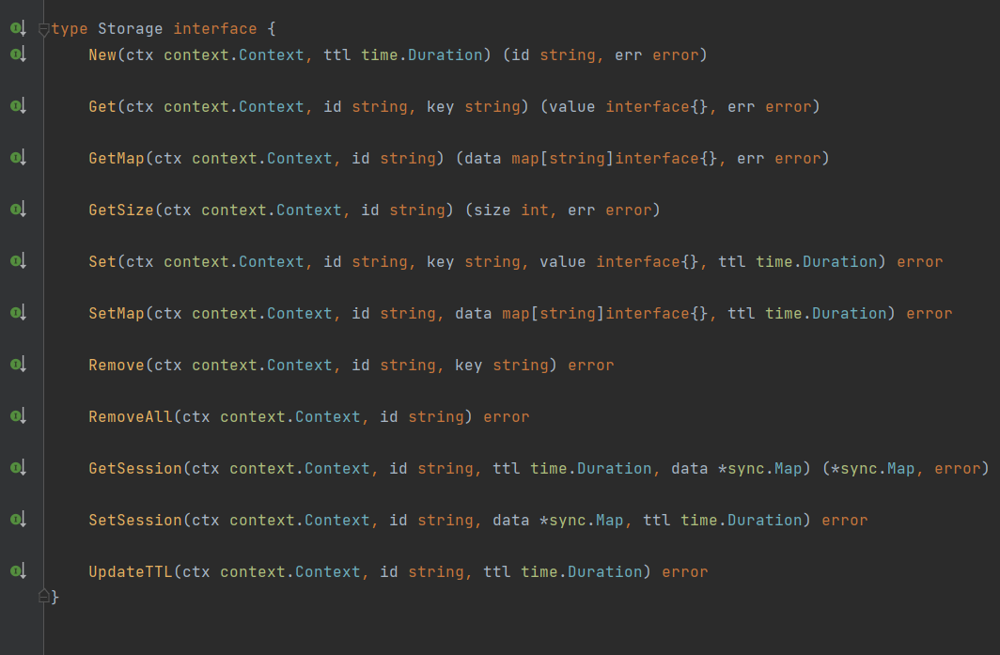

## xsession

xtcp 是 一个session存储组件，存储方式有内存存储和redis存储，redis下可满足多节点使用。主要对象为manager和session，内部提供与gin框架结合的server，有条件时在开发web路由框架时就集成进去。

## 快速开始

#### 服务端

```
package main

import (
   "github.com/gin-gonic/gin"
	"github.com/go-redis/redis"
	"github.com/motai3/xsession/pkg"
	xhttp "github.com/motai3/xsession/pkg/http"
)

func main() {
    //使用内存存储时无需设置存储方式，直接使用即可
    s := xhttp.Default()
	s.Engine.GET("/test/:name", func(c *gin.Context) {
        //在开发之初把manager集成进server，session集成进request使用会方便很多
		session, _ := xhttp.GetSession(c)
		if session.Get("k1") == nil {
			session.Set("k1", "v1")
			data := make(map[string]interface{})
			data["k2"] = "v2"
			data["k3"] = "v3"
			session.Sets(data)
		}

		name := c.Param("name")
		c.JSON(200, gin.H{
			name: session.Get(name),
		})
	})
	s.Run(":8000")
}
```

使用redis存储

```
package main

import (
   "github.com/gin-gonic/gin"
	"github.com/go-redis/redis"
	"github.com/motai3/xsession/pkg"
	xhttp "github.com/motai3/xsession/pkg/http"
)

func main() {
   redis := redis.NewClient(&redis.Options{
		Addr:     "43.138.13.24:6379",
		Password: "",
		DB:       0,
	})
	s := xhttp.Default()
	s.SetSessionStorage(xsession.NewStorageRedis(redis))
	s.Engine.GET("/test/:name", func(c *gin.Context) {
		session, _ := xhttp.GetSession(c)
		if session.Get("k1") == nil {
			session.Set("k1", "v1")
			data := make(map[string]interface{})
			data["k2"] = "v2"
			data["k3"] = "v3"
			session.Sets(data)
		}

		name := c.Param("name")
		c.JSON(200, gin.H{
			name: session.Get(name),
		})
	})
	s.Run(":8000")
}
```

## 存储方式拓展


实现上面接口，并提供创建方法即可。可以根据需要进行实现，比如文件存储，数据库存储之类的